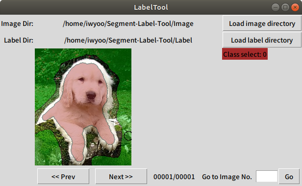

Segment-Label-Tool
==================

A simple labeling tool for segmentation with Python Tkinter



Run
--- 
```$ python main.py```

How to use
---
1. Load image directory. (Image files should have .jpg or .jpeg extension.)
2. Load label directory. (If you want to assign labels before you annotate them, their file names without its extension should be paired with the jpg images.) 
3. Left mouse button (Button-1) is for drawing and right mouse button (Button-3) is for erasing. (Buttons may be assigned differently depending on the environment such as the OS.)
4. Label will be saved when you push `a` or `d`.

Commands
--------
* `a`: Go to previous image
* `d`: Go to next image
* `w`: Increase cursor radius
* `s`: Decrease cursor radius
* `q`: Change to previous class
* `e`: Change to next class
* `7`: Assign all pixels with the current class
* `h`: Toggle label
* `o`: Decrease opacity
* `p`: Increase opacity


Reference
----------
* This code is totally based on https://github.com/puzzledqs/BBox-Label-Tool
